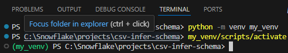

# CSV Data Ingetion Automation

This blog discusses an approach for automating CSV data ingestion into Snowflake table using Snowpark Python.


## :loudspeaker: Introduction

Schema inference, also called schema detection, is a process in which a function analyses a dataset structure and content to automatically determine the data type and structure of the data without explicit user specification. 

INFER_SCHEMA is a table function, that comes prebuilt in Snowflake and has been available for a while. It supports infering CSV and other file formats in internal and external stages. 

More reads :: [INFER_SCHEMA](https://docs.snowflake.com/en/sql-reference/functions/infer_schema)

In this blog, I will discuss how to write an automation script that utilises INFER_SCHEMA table function for schema evaluation,adding some functionality to create desired schema dynamically, leading to a significant reduction in development effort to load data directly into Snowflake tables.


## :thinking: Prerequisites

* Python version 3.11 installed on local machine

* Snowflake trial account


## :thinking: High Level Design


* We will create a named stage. This stage could be internal or exetrnal, but to keep things simple and avoid any dependencies, we will use named internal stage

* The named stage will store CSV files. We will create this named stage using Snowsight UI and upload CSV files 

* The CSV file names will be used as table name in Snowflake 

* Using the list stages SQL command, we will list all CSV files in our stage

* We will then iterate through this list of CSV files to extract filenames

* For each filename, we will build a dynamic SQL statement. This statement will run INFER_SCHEMA SQL command to extract column names and column types.

* We will create another dynamic statemnt that will eventually will be convrted into Table DDL and COPY commands

* We will save these SQL files locally and execute them in Snowflake warehouse using Snowpark

* This entire process automates data ingestion process from CSV file to Snowflake tables. 


## :test_tube: Create database 

* Log into Snowflake account and open a new SQL worksheet

* Ensure that you use SYSADMIN role to execute SQL statements

* Ensure that you select COMPUTE_WH or any other warehouse to run your SQL statements

* Create database as follows
```
Create database SnowIngest
```


## :test_tube: Create schema

* Although we can use the default Public schema, I like to create my own schema for dev work

* Create schema as follows
```
Create schema AutoCSVIngestion
```


## :test_tube: Create File Format

* Create a file format with skip_header option as follows
```
create or replace file format file_format_skip_header
    type = 'csv' 
    compression = 'auto' 
    field_delimiter = ',' 
    record_delimiter = '\n'  
    field_optionally_enclosed_by = '\042' 
    skip_header = 1;
```

## :test_tube: Create File Format

* Create a csv file format as follows
```
create or replace file format file_format_csv
    type = 'csv' 
    compression = 'auto' 
    field_delimiter = ',' 
    record_delimiter = '\n'  
    field_optionally_enclosed_by = '\042' 
    skip_header = 1;
```

* As per Snowflake documentation, SKIP_HEADER option is not supported with PARSE_HEADER = TRUE.That's why we create two different file formats
More reads :: [CREATE FILE FORMAT](https://docs.snowflake.com/en/sql-reference/sql/create-file-format)

* We will use file_format_skip_header along with INFER_SCHEMA table function in order to get CSV file column name and type

* We will use file_format_parse_header in the COPY command to ingest rows of data from CSV file


## :test_tube: Create File Format

* Create internal stage as follows
```
CREATE OR REPLACE STAGE my_stage
  FILE_FORMAT = file_format_skip_header;
```


## :test_tube: Enable Directory Table for internal stage


* Using Snowsight UI, navigate to Databases->SnowIngest->Stages->my_stage and click on "Enable Directory Table" button


## :test_tube: Upload files to internal stage

* Click on Files button


* Add the CSV's provided in Resources folder, and click Upload botton to upload these files to internal stage


## :test_tube: Run Python script

* Download the "CSV Data Ingestion Automation" folder to your local machine

* Open this folder in Visual Studio Code (VSC)

* Open the auto-ingest-csv.py file and locate the function snowpark_basic_auth  on line 6. As you can see, this is a function that returns a Snowpark Session object. This is required to run the dynamically generated SQL statements to create tables. Please provide the required values for account, user and password from your own Snowflake trial account, and save this file.

```
def snowpark_basic_auth():
    connection_parameters = {
        "account": '',
        "user": '',
        "password": ''
    }

    return Session.builder.configs(connection_parameters).create()
```

* From the View menu in VSC, open a terminal and run the following command to create a virtual environment

```
python -m venv my_venv
```


* Run the following command to activate virtual environment

```
my_venv/scripts/activate
```



* If you look at file requirements.txt file, we only need to install snowflake-snowpark-python

* Run the following command to download and install dependencies

* Note : I already have snowflake-snowpark-python available in my virtual environment, so I get Requirement already satisfied message. You will get different messages if you are following this blog and installing snowflake-snowpark-python in your virtual environment for the first time

```
pip install -r requirements.txt
```


* Run the following command to execute the script
```
python auto-ingest-csv.py
```

* You should see the script executed successfully. The script displays total execution time. 


* You should see 3 sql files in VSC explorer. These were generated by our script. Open any of these and look at the SQL statements generated by our script that were executed in Snowflake warehouse using Snowpark. 


* Back in Snowflake Snowsight UI, you should be able to see 3 new tables created in your SnowIngest database AutoCSVIngestion schema. 


* Congratulations...:clap::clap::clap: You have successfully set up and run the auto ingest csv script


## :walking: Script walk through

* Open the auto-ingest-csv.py in VSC

* There are 3 functions that are called from the main function.

* The first function is snowpark_basic_auth, that returns a Snowpark Session object using basic authentication. The other authentication types that can be used are Key Pair Authentication and SSO based authentication.

* Snowpark Session object returned after authentication is required to run the dynamically generated SQL statements to create tables. 

* Please ensure that you provide the required values for account, user and password from your own Snowflake trial account.
```
def snowpark_basic_auth():
    connection_parameters = {
        "account": '',
        "user": '',
        "password": ''
    }

    return Session.builder.configs(connection_parameters).create()
```

* The second function is generate_ddl_statement that takes outpu of INFER_SCHEMA and generates DDL statement required to run in Snowflake warehouse. The function works with the column names, data types and table names provided as input parameters from main method
```
def generate_ddl_statement(column_names,data_types,table_name):
    ddl_template = "CREATE TABLE IF NOT EXISTS {} (\n{});"
    columns = []
    for name, data_type in zip(column_names,data_types):
        column_definition = f"{name} {data_type}"
        columns.append(column_definition)

    ddl_statement = ddl_template.format(table_name, ",\n".join(columns))
    return ddl_statement
```

* The third function is generate_copy_statement that generates COPY statement required to ingest data from CSV files. The function works with the table name, stage name, CSV file path and file format provided as input parameters from main method
```
def generate_copy_statement(table_name,stage_name,csv_file_path,file_format):
    copy_command = f"""
    COPY INTO {table_name}
    FROM @{stage_name}/{csv_file_path}
    FILE_FORMAT = (FORMAT_NAME = '{file_format}')
    """
    return copy_command
```

* The very first line in main function captures the start date and time. 
```
utc_start_time = datetime.utcnow()
```

* Next, we obtain the Snowpark Session object by calling the snowpark_basic_auth function
```
    session_with_pwd = snowpark_basic_auth()
```

* Next, we set the query_tag for tracking purpose
 ```
    session_with_pwd.sql("alter session set query_tag = '(v0) Start Snowpark Automation - " + str(utc_start_time))
```

* Next, we change the context to use the database, schema and warehouse for running our script
```
    session_with_pwd.sql("use role sysadmin").collect()
    session_with_pwd.sql("use database SNOWINGEST").collect()
    session_with_pwd.sql("use schema AUTOCSVINGESTION").collect()
    session_with_pwd.sql("use warehouse compute_wh").collect()
```

* Next, we fetch all staged files 
```
    stg_files = session_with_pwd.sql("list @my_stage").collect()
```

* We then iterate through all staged files and construct infer_schema statement
```
    for row in stg_files:
        row_value = row.as_dict()
        stg_file_path_value = row_value.get('name')

        #split the file path and extract names
        file_path, file_name = os.path.split(stg_file_path_value)
        stg_location = "@" + file_path

        infer_schema_sql = """ \
            SELECT *
            FROM TABLE(
            INFER_SCHEMA(
            LOCATION => '{}/',
            files => '{}',
            FILE_FORMAT => 'file_format_parse_header'
            )
        )
        """.format(stg_location,file_name)
```

* The dynamically created infer_schema statement created in earlier step will be executed and the result is stored in inferred_schema_rows
```
        inferred_schema_rows = session_with_pwd.sql(infer_schema_sql).collect()
```

* From the result stored in inferred_schema_rows, our script extracts the Type and Column_name attributes required to construct DDL statemnt later.
```
        col_name_lst = []
        col_data_type_lst = []

        for row in inferred_schema_rows:
            row_value = row.as_dict()
            column_name = row_value.get('COLUMN_NAME')
            column_type = row_value.get('TYPE')
            col_name_lst.append(column_name)
            col_data_type_lst.append(column_type)
```

*   generate_ddl_statement and generate_copy_statement take the entire output generated in earlier code to construct DDL and COPY statements dynamically           

``` 
        table_name = file_name.split('.')[0]
        create_ddl_stmt = generate_ddl_statement(col_name_lst,col_data_type_lst,table_name.upper())
        copy_stmt = generate_copy_statement(table_name,'my_stage',file_name,'file_format_csv')
``` 

* The dynamically generated DDL and COPY statements and written to files on local system. These files can also be stoted in any version controlled system like github
```     
        sql_file_path = table_name + ".sql"
        with open(sql_file_path,"w") as sql_file:
            sql_file.write("- Create table\n")
            sql_file.write(create_ddl_stmt)
            sql_file.write("\n- Execute copy command\n")
            sql_file.write(copy_stmt)
```                 

* All SQL statements are executed in the following lines of code
```     
        session_with_pwd.sql(create_ddl_stmt).collect()
        session_with_pwd.sql(copy_stmt).collect()
```
* We capture the end time and print the time taken for entire script execution
```
        utc_end_time = datetime.utcnow()
        session_with_pwd.sql("alter session set query_tag = '(v0) End Snowpark Automation - " + str(utc_end_time))
        print(utc_end_time-utc_start_time)
```

## :tada: Summary

In this blog, we saw the power of infer_schema table function for schema detection. Adding some intelligent code on top of the output from infer_schema, it is supe easy to ingest hundreds of CSV file automatically, thus saving time and effort, improving efficiency and avoiding any errors that may be caused by following a manual process to achieve the same result.

Please feel free to modify and use this code for your purposes, and let me know your thoughts, comments and any feedback about this blog.

Thanks for your time, and see you soon on another blog.